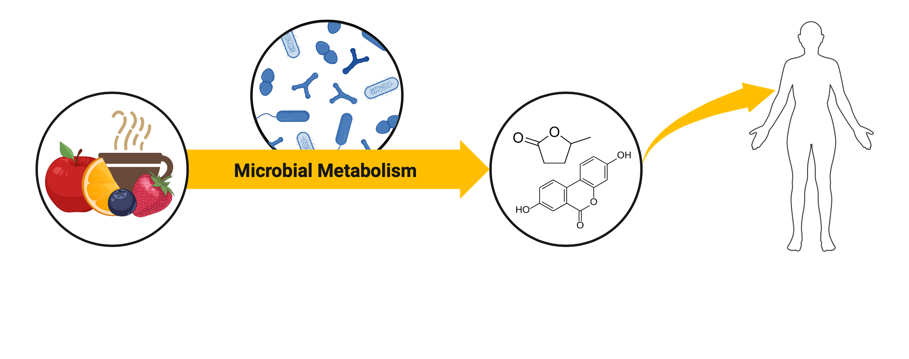

# Science Communication Gallery

Welcome to my gallery of science communication visuals. Find logos that I've created for various software programs as well as engaging visuals that help simplify complex data. I primarily utilize Adobe Illustrator, but I also use other visualization tools including:
- Canva (Free and paid versions)
- BioRender (Free with Institutional Access)
- ggplot2, an R package (Free)

If you’d like to collaborate or learn more, please reach out [via email](https://swi1.github.io/SMG.Wilson/contact/).

## Logos

  <figure>
    
    <figcaption><a href="https://doi.org/10.1093/bioadv/vbad165">TaxaHFE program</a></figcaption>
  </figure>
  <figure>
    
    <figcaption><a href="https://richtext-semantic-food-mapper.hf.space/">FoodMapper: An Advanced semantic matching tool for aligning food descriptions across nutritional databases</a></figcaption>
  </figure>

## Schematics

Feedback loop between nutrition/diet, optimization of diet and consumer costs, and the molecular breeding of foods. 

 

Simple schematic displaying how the polyphenols we consume can undergo microbial metabolism and generate phenolic derivatives. These phenolic derivatives can often have greater impacts on the health outcomes than the original compound. Created in BioRender.

